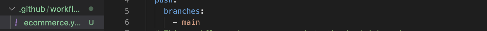
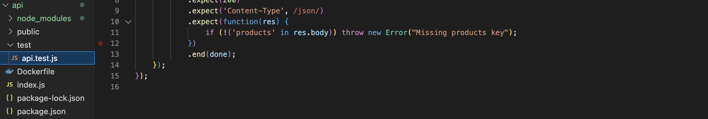
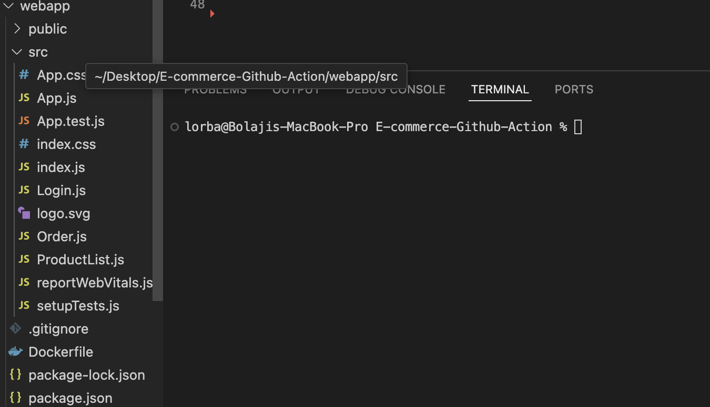
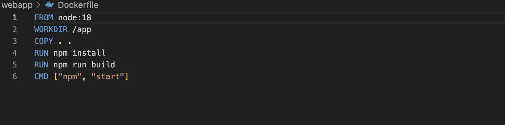
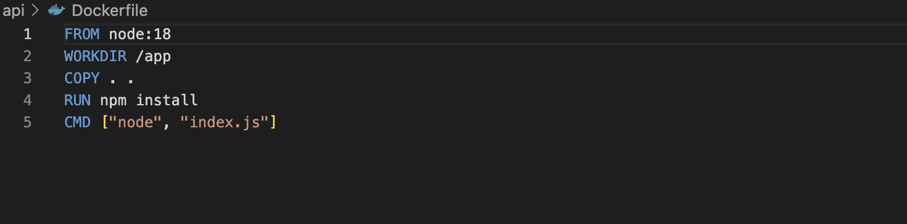
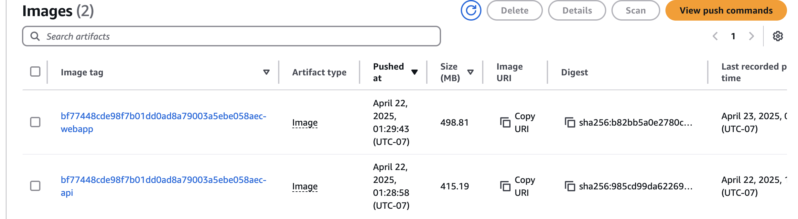

#### Capstone Project: E-Commerce Application CI/CD Pipeline

### Project Overview: Automated Pipeline for an E-Commerce Platform.

### Objectives: 

## Developing and maintaining an e-commerce platform. This platform has two primary components:

 - E-Commerce API: Backend service handling product listings, user accounts, and order processing. 

 - E-Commerce Frontend: A web application for users to browse products, manage their accounts, and place orders.
 
## The goal is to automate the integration and deployment process for both components using GitHub Actions, ensuring continuous delivery and integration.

## Project Tasks: 

# Task 1: Project Setup 

- Creating a new GitHub repository named `'E-commerce-Github-Action`.

- Inside the repository, two directories are created: `api` for the backend and `webapp` for the frontend. 
 
 # Task 2: Initialize GitHub Actions 
 
- Initializing a Git repository and adding the initial project structure. 
 
- Creating .github/workflows directory in my repository for GitHub Actions.

## Task 3: Backend API Setup

-  In the `api` directory, a simple Node.js/Express application is setup which handles basic e-commerce operations.

-  A unit tests is implemented for the API.   See image below.

## Task 4: Frontend Web Application Setup

 In the `webapp` directory, a simple React application that interacts with the backend API is created and Ensuring the frontend has basic features like  
   product listing, user login, and order placement. See image below.

   

## Task 5: Continuous Integration Workflow

 Writting a GitHub Actions workflow `ecommerce.yaml` for the backend and frontend that: Installs dependencies, Runs tests and Builds the application.

## Task 6: Docker Integration 

Creating Dockerfiles for both the backend and frontend and Modifying the GitHub Actions workflows to build Docker images.

The above images are the Dockerfile for both API and Webapp (Frontend and Backend).

## Task 7: Deploying to AWS

A repository named `nodejs-app` is created on ECR, and instructions are given on my Yaml workflows to build, push and tag images for both Frontend and Backend. I have initailly confirgured my Github account with the AWS credentials, the instructions are declared in my workflows as secrets.

The image below shows the Docker images for both frontend and backend in the ECR (Elastic container Registry)

## Task 8: Continuous Deployment

Configuring the workflows to deploy updates automatically to the cloud environment(AWS-ECR) when changes are pushed to the main branch.